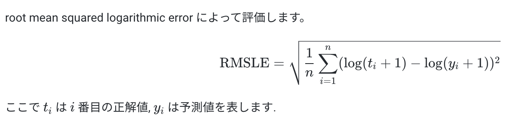
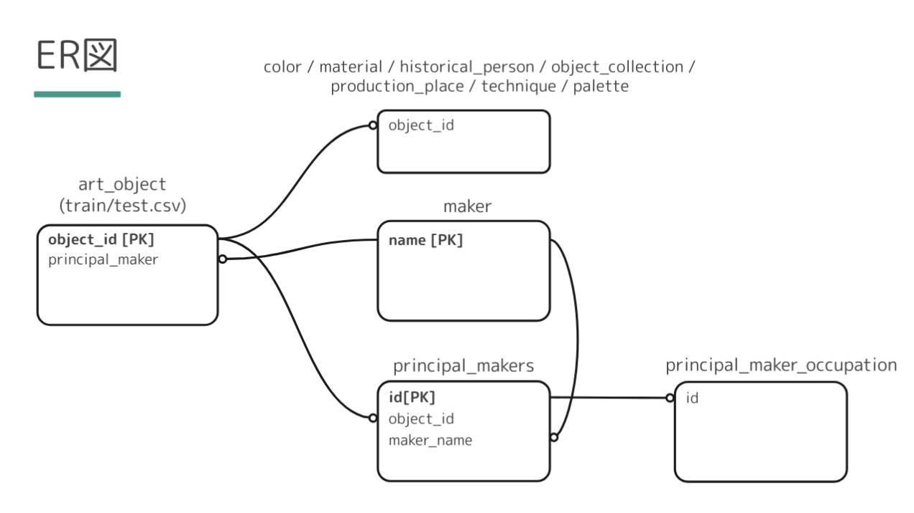
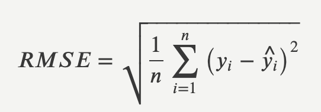
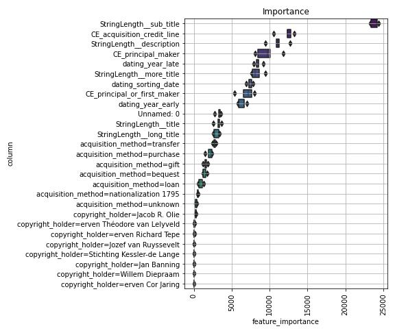

# atmacup10
atmacup#10 美術作品のいいね数の予測

## Evaluation
評価指標はRMLSE.

## Datasets

# Log

### 20210705
- join
- data download

- nb001
    - データをgoogleスプレッドシートで眺めてみる。
    - __train.csv__
        - sub_title: cmとmmで、単位が揃っていない。
        - copyright_holder: ほとんどが欠損。全く埋まってない。
        - acquisition_method: unknown(収集方法不明)とかもあるんだな。
        - acquisition_credit_line: (収集に際して資金提供などを行った場合の情報)も空欄が多いかな。
        - dating_presenting_date: 制作期間がきちんと書かれている（ex. 1990-2000）のもあるが、c. 1619 - c. 1625や、1999（代表年だけ？）のものもあり、表記が揃っていない。
        - dating_sorting_date : 並び替え用に使用される、作品の代表年

### 20210706
- データ確認の続き
    - test.csv
        - train.csvと似たような感じ
        - acquisition_dateもちょくちょく抜けているな

    - material.csv
        - 同一のobject_idに対して複数のname　・・・　複数のマテリアルで作られてるのがほとんどだな
        - 何の紙に書いているか（paper, photographic paper, canvas, etc.)と、何で書いているか？(oil paint)

    - maker.csv
        - データほとんど欠損
        - 名前と誕生日〜死亡した場所まで書かれている人と、名前しか書かれていない人の両極端
        - 国籍はほとんどの作家が不明
        - 死亡した場所：アムステルダム、パリ、など

    - production_place.csv
    - historical_person.csv
        - 人物の名前で、かっこ付けで長く表記されている人がちらほら見られるがどういう意味のかっこだ？
        - Elisabeth Stuart (keurvorstin van de Palts, koningin van Bohemen) めちゃくちゃ長い

    - object_collection.csv
        - 作品の形式タイプ
        - paintings, musical instrumentsとかもあるんだ、
        - 10種類ほど

    - principal_maker.csv
        - idカラムが、principal_maker_occupation.csvのidと紐づく
        -  qualification(どのような関わり方をしたか？)：mentioned on object、workshop of... 欠損ちらほら
        - qualiication, roles, productionPlaces が同時に空のものもある

    - principal_maker_occupation.csv
    - technique.csv
    
- 現象の理解
    - このデータはどういうふうに作られているか？
    - train.csv[acquisition_method]を見ると、さまざまな収集方法がある。いいね数で比較すると、いいねが多い作品は"loan", "purchase", "bequest(遺贈された)"などが多い印象。対していいねが少ない作品は"transfer"などが多いような。
    
    
    つまり、状態が良い作品にはいいねしたくなるのではないか？

- 予測対象の確認
    - 予測対象　＝　いいねの数
    - よって、出力値は０以上の整数
    
- 評価指標の確認
    - 評価指標　＝　RMSLE
    - だが、RMSLEは一度log1p変換をするとRMSEとして取り扱えるらしい
    - log1pってなんぞ？？
        - おそらく、　log(1+x) ≒ x とすること？
        
        そう考えれば、RMSLEとRMSEは等価だと考えられるのではないか
        
        
        
        
        
    - 一般的なモデルの損失関数ではRMSEが使えるからRMSEで取り回したほうが良さそう
    
    
### 20210707
- ProfileReportを作成
    - copyright_holderカラムは欠損率率９０％以上（train, testどちらも）　→ 意味のない特徴量のような気がする。
    - acquisition_credit_lineも欠損率７０％以上（train, testどちらも）　→ 意味のない特徴量の疑い
    - 収集の際の売り買いなどの情報はあまり予測に必要ないか(acquisition_credit_line)
    
- trainとtestで被りのデータがないか確認
    - trainに含まれる作品がtestにも含まれていたら、その作品に対する予測は精度高くなるよね。
    
    |train,testで被りが多いカラム|被りが少ないカラム|
    |---|---|
    |dating_sorting_date|sub_title|
    |dating_year_early|more_title|
    ||title|
    ||long_title|
    
    - art_series_idとobject_idは全く被っていない、ユニーク
    - 同じシリーズ、作品のものがない？でもtitleとかは被っている？
    - trainとtestでは全く違う作品だと思っていたほうがいいか
    
- Count Encordingについて
    - カテゴリカル変数のencordingの一つ
    - データに含まれるカテゴリの出現回数を、そのままそのカテゴリの値とするもの
    - 次元が増えない。
    - One-hot-encordingの場合、カテゴリの種類が非常に多いと、カラム数が膨大に増えてしまう。見づらい。
    
- LabelEncordingについて
    - 各カテゴリにそのまま数値を当てはめるだけ
    - 例　[赤、青、黄] 　＝ [0, 1, 2]
    

- オブジェクト型の各変数の変換種類とその理由
    
    |feature|encording type|reason|
    |---|---|---|
    |title|文字数|タイトルの違いだけで特徴があるとは思えない。タイトルの長さも評価者は見ているかも|
    |description|文字数|カテゴリではないため|
    |long_title|文字数|カテゴリではないため|
    |principal_maker|CountEncording(;CE)|ユニーク数2221と膨大なため|
    |principal_or_first_maker|CE|ユニーク数2249と膨大なため|
    |sub_title|文字数|カテゴリではないため|
    |copyright_holder|One-Hot-Encording(;one-hot)|ユニーク数32と少ないため。けど欠損多いから使わないだろうな。|
    |more_title|文字数|カテゴリではないため|
    |acquisition_method|one-hot|ユニーク数８と少ないため|
    |acquisition_credit_line|CE|ユニーク数429と多いため。けど欠損多いから使わないかも|

- LightGBMインストールのため、brewをインストール（詳しくはwiki)

- log1p変換の意味がわかった
    (正解値y+1) を、底辺eの対数で変換すること
    
    y' = log_e(y+1)
    
    +1する理由は、y=0の時も対数変換できるようにするため。
    
- nb002
    - データの前処理
    - テキスト型の変数は文字数で数値化
    - カテゴリカル変数は、カーディナリティ（カテゴリのユニーク数）が大きいものはCountEncording, カーディナリティが少ないものはone-hot で数値化する
    - 前処理後、pre1_train.csv, pre1_test.csvへ出力保存
    
    
- nb003
    - 正解値をlog1p変換して学習・評価 →テスト予測時に出力値を元に戻す
    - 決め打ちでパラメータ設定
        - learning_rate: 1
        - max_depth: 5
        - n_estimators: 10000 (early_stopping_roundsは100で設定)
        - min_child_samples: 10
        - その他諸々
        
    - 交差検証はk=5でKFold
    - 結果、スコア　RMSLE = 1.1773
    
#### [考察]特徴量重要度

    - sub_titleの文字数が重要なようだ。sub_titleは作品の大きさ。文字数が多い＝作品が大きい？
    
    - 確認したところ、大きい作品ほどいいねが多いかもしれない
    
    - CE_acquision_credit_line: 欠損値も多いが、"On loan from the City of Amsterdam" など、資金提供にアムステルダム市が関わっているものはいいねを多くもらっている気がする
    
    - description: 作品に関する説明量がいいね数に比例する？（要確認）
    
    - more_title: description同様、説明量に比例していいねをもらいやすいかも（要確認）
    
    - CE_principal_maker: 著者の名声に比例しそうなのはイメージしやすい
    
    - dating_year_late, dating_sorting_date, dating_year_early: 年度の３カラムは全て重要度上位。年代別に人気度が分かれているのかも
    
